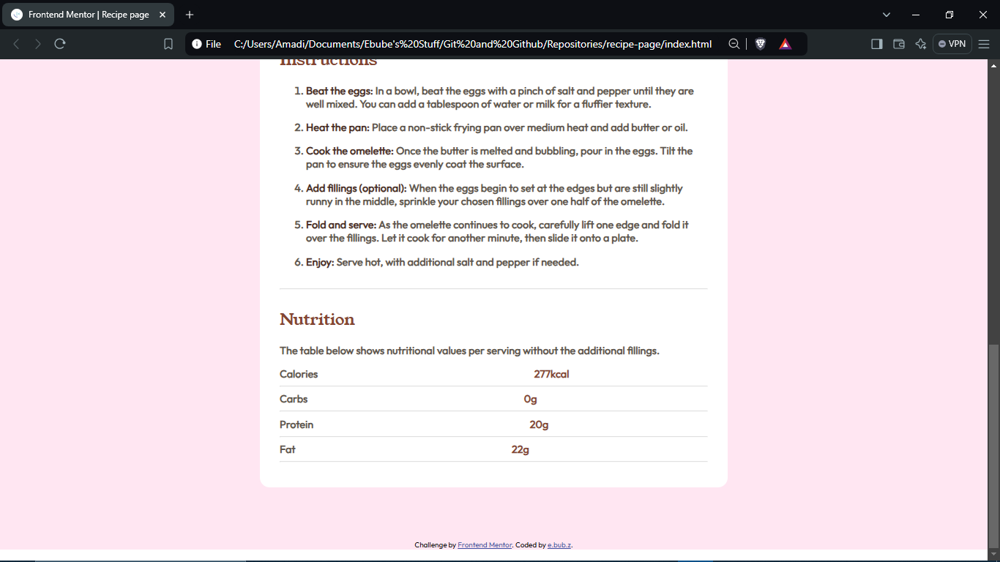

# Frontend Mentor - Recipe page solution

This is a solution to the [Recipe page challenge on Frontend Mentor](https://www.frontendmentor.io/challenges/recipe-page-KiTsR8QQKm). Frontend Mentor challenges help you improve your coding skills by building realistic projects. 

## Table of contents

  - [The challenge](#the-challenge)
  - [Screenshot](#screenshot)
  - [Links](#links)
  - [Built with](#built-with)
- [Author](#author)

### Screenshot

### Links

- Solution URL: [Add solution URL here](https://github.com/ebubz-dev/recipe-page)
- Live Site URL: [Add live site URL here](https://ebubz-dev.gihub.io/recipe-page/)

### Built with

- Semantic HTML5 markup
- CSS custom properties

## Author

- Website - [Add your name here](https://ebubz-dev.github.io)
- Frontend Mentor - [@yourusername](https://www.frontendmentor.io/profile/ebubz-dev)